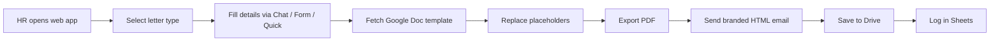

# HR-Automation

**HR Letter Automation System** — built for [Atoms Digital Solutions](https://www.linkedin.com/search/results/all/?keywords=Atoms%20Digital%20Solutions) and actively used by their HR team. Generates, personalizes, and dispatches offer letters, experience letters, and more in under 60 seconds.

---

## The Problem

HR teams manually write, format, and send every letter or certificate. It's slow, repetitive, and error-prone — especially when headcount scales.

**Before:** ~15 minutes per letter, frequent formatting errors, inconsistent branding
**After:** < 1 minute per letter, zero manual formatting errors, template-driven consistency

---

## What It Does

A **multi-interface web app** built on Google Apps Script that lets HR choose the workflow that fits the moment:

| Mode | Interface | Best When |
|------|----------|-----------|
| **Chat** | Conversational bot | HR prefers guided step-by-step input |
| **Form** | Multi-step slide form | Structured data entry for complex letters |
| **Quick** | Paste-and-go template | Fast dispatch, bulk sending, single letters |

---

## Supported Letter Types

- Offer Letter
- Offer Letter with Probation
- Internship Offer Letter
- Experience Letter
- Relieving Letter
- Termination Letter
- Certification of Appreciation
- Certification of Completion
- Best Employee of the Month
- Best Employee of the Year

---

## Core Features

- **Auto PDF generation** — pulls from Google Docs templates, replaces `{{placeholders}}`, exports as PDF
- **Gmail integration** — sends branded HTML emails with PDF attached automatically
- **Google Drive storage** — auto-organizes sent PDFs by letter type and year
- **Dynamic fields** — form fields adapt based on selected letter type
- **Conditional salary hike logic** — handles probation + hike scenarios automatically
- **Auto-logging** — every sent letter is logged with timestamp, status, and Drive link
- **One-click sheet beautify** — color-coded statuses and formatting in the data sheet
- **Live preview** — catch errors before dispatch

---

## Tech Stack

| Layer | Tools |
|-------|-------|
| **Backend** | Google Apps Script |
| **Frontend** | HTML / CSS / JavaScript |
| **Data & Logging** | Google Sheets |
| **Email** | Gmail API + HTML templates |
| **Storage** | Google Drive API |
| **Templates** | Google Docs with `{{placeholder}}` system |

---

## How It Works

1. Open the web app and choose a letter type
2. Enter employee details via the interface that fits the task
3. System fetches the matching template and fills placeholders
4. PDF is generated, attached to a branded HTML email, and sent
5. PDF is saved to the correct Drive folder
6. Every action is logged with timestamp, status, and recipient

---

## Impact

- **20+ letters** sent since deployment
- **Actively used** by HR at [Atoms Digital Solutions](https://www.linkedin.com/search/results/all/?keywords=Atoms%20Digital%20Solutions)
- Dispatch time: **~15 min → < 1 min** per letter
- Zero manual formatting errors since go-live

---

## Built By

**Mokshith Puvvada**
AI/ML Intern, Atoms Digital Solutions Pvt. Ltd.
B.Tech Computer Science, 2nd Year (2026 batch)

---

> *Built during my internship at Atoms Digital Solutions, Guntur, Andhra Pradesh.*

## Connect

If you're building internal tools that solve real problems, I'd love to connect.

[LinkedIn](https://www.linkedin.com/in/venkata-siva-sai-mokshith-puvvada-9001b130a) · [GitHub](https://github.com/Mokshith1817/HR-Automation)
---

## License

MIT
